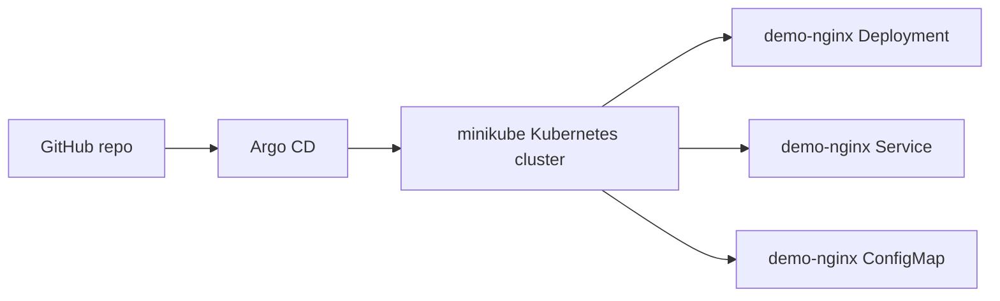

# GitOps With Argo CD Demo

This demo installs a local Kubernetes cluster with minikube, installs Argo CD, pushes a simple Kubernetes app to GitHub, and lets Argo CD deploy the app from GitHub.

The sample app contains:

- `Deployment`
- `Service`
- `ConfigMap`
- Argo CD `Application`

## Demo Architecture



## Prerequisites

Install these tools on your laptop:

- Docker, Podman, VirtualBox, KVM, or another minikube-supported driver
- `minikube`
- `kubectl`
- `git`
- GitHub account
- Optional: Argo CD CLI `argocd`

Check tools:

```bash
docker --version
minikube version
kubectl version --client
git --version
```

If `kubectl` is not installed, minikube can still run kubectl commands like this:

```bash
minikube kubectl -- get pods
```

## Step 1: Start minikube

```bash
minikube start --cpus=2 --memory=4096
```

Check the cluster:

```bash
kubectl get nodes
kubectl get pods -A
```

Expected result:

- One Kubernetes node is `Ready`.
- Core Kubernetes pods are running.

## Step 2: Install Argo CD

Create the Argo CD namespace:

```bash
kubectl create namespace argocd
```

Install Argo CD:

```bash
kubectl apply -n argocd --server-side --force-conflicts \
  -f https://raw.githubusercontent.com/argoproj/argo-cd/stable/manifests/install.yaml
```

Wait until Argo CD components are ready:

```bash
kubectl -n argocd get pods
kubectl -n argocd wait --for=condition=Available deployment --all --timeout=300s
kubectl -n argocd rollout status statefulset/argocd-application-controller --timeout=300s
```

## Step 3: Access Argo CD UI

Open a port-forward to the Argo CD API/UI service:

```bash
kubectl -n argocd port-forward svc/argocd-server 8080:443
```

Open this URL in your browser:

```text
https://localhost:8080
```

The browser will show a certificate warning because the local Argo CD installation uses a self-signed certificate. Accept it for this local demo.

Get the initial admin password:

```bash
kubectl -n argocd get secret argocd-initial-admin-secret \
  -o jsonpath="{.data.password}" | base64 -d; echo
```

Login:

```text
Username: admin
Password: <password from command>
```

## Step 4: Optional CLI Login

If you installed the Argo CD CLI:

```bash
export ARGOCD_PASSWORD=$(kubectl -n argocd get secret argocd-initial-admin-secret \
  -o jsonpath="{.data.password}" | base64 -d)

argocd login localhost:8080 \
  --username admin \
  --password "$ARGOCD_PASSWORD" \
  --insecure
```

## Step 5: Create a GitHub Repository

Create a new GitHub repository, for example:

```text
argocd-student-demo
```

Use a public repository for the easiest classroom demo. For a private repository, you must add GitHub credentials to Argo CD first.

From this demo folder, initialize Git and push:

```bash
git init
git add .
git commit -m "Initial Argo CD demo app"
git branch -M main
git remote add origin https://github.com/<YOUR_GITHUB_USER>/argocd-student-demo.git
git push -u origin main
```

Replace:

```text
<YOUR_GITHUB_USER>
```

with your GitHub username or organization.

## Step 6: Update the Argo CD Application Repo URL

Set your repo URL:

```bash
export GITHUB_REPO_URL="https://github.com/<YOUR_GITHUB_USER>/argocd-student-demo.git"
```

Preview the generated Argo CD Application:

```bash
sed "s|REPLACE_WITH_GITHUB_REPO_URL|$GITHUB_REPO_URL|g" \
  argocd/application.yaml
```

Apply it:

```bash
sed "s|REPLACE_WITH_GITHUB_REPO_URL|$GITHUB_REPO_URL|g" \
  argocd/application.yaml | kubectl apply -f -
```

What this creates:

- Argo CD `Application` named `demo-nginx`
- Target namespace `demo-app`
- Automated sync enabled
- Prune enabled
- Self-heal enabled
- Namespace auto-creation enabled

## Step 7: Watch Argo CD Deploy the App

Check the Argo CD Application:

```bash
kubectl -n argocd get applications
kubectl -n argocd describe application demo-nginx
```

If using Argo CD CLI:

```bash
argocd app get demo-nginx
argocd app wait demo-nginx --sync --health --timeout 300
```

Check Kubernetes resources:

```bash
kubectl -n demo-app get all
kubectl -n demo-app get configmap
kubectl -n demo-app describe deployment demo-nginx
```

Expected result:

- Namespace `demo-app` exists.
- Deployment `demo-nginx` exists.
- Service `demo-nginx` exists.
- ConfigMap `demo-nginx-html` exists.
- Pods are running.

## Step 8: Access the Demo App

Because the Service is `NodePort`, minikube can expose it:

```bash
minikube service demo-nginx -n demo-app --url
```

Open the printed URL in your browser, or test with curl:

```bash
APP_URL=$(minikube service demo-nginx -n demo-app --url)
curl "$APP_URL"
```

Expected page:

```text
Hello from Argo CD GitOps Demo
Version 1
```

## Step 9: Demonstrate GitOps Change

Change the app content in Git:

```bash
sed -i 's/Version 1/Version 2/g' manifests/configmap.yaml
git add manifests/configmap.yaml
git commit -m "Update app page to version 2"
git push
```

In Argo CD UI:

1. Open application `demo-nginx`.
2. Click `Refresh` if you want to detect the change immediately.
3. Watch the app move to `OutOfSync`.
4. Because automated sync is enabled, Argo CD syncs the change.

From CLI:

```bash
argocd app get demo-nginx
argocd app wait demo-nginx --sync --health --timeout 300
```

Test the app again:

```bash
curl "$APP_URL"
```

Expected page:

```text
Hello from Argo CD GitOps Demo
Version 2
```

Teaching point:

GitHub is the source of truth. The cluster changed because Git changed, not because we manually applied the manifest.

## Step 10: Demonstrate Drift and Self-Heal

Manually change the live cluster:

```bash
kubectl -n demo-app scale deployment demo-nginx --replicas=1
kubectl -n demo-app get deployment demo-nginx
```

Argo CD should detect that the live cluster no longer matches Git. Because `selfHeal: true` is enabled, Argo CD returns the deployment to the Git-defined value:

```yaml
replicas: 2
```

Watch it:

```bash
kubectl -n demo-app get deployment demo-nginx -w
```

Stop watching with:

```bash
CTRL+C
```

If you want to force Argo CD to refresh immediately:

```bash
kubectl -n argocd annotate application demo-nginx \
  argocd.argoproj.io/refresh=hard --overwrite
```

Teaching point:

Manual cluster changes are drift. Argo CD corrects drift when self-heal is enabled.

## Step 11: Demonstrate Prune

Delete the Service manifest from Git:

```bash
git rm manifests/service.yaml
git commit -m "Remove service to demonstrate prune"
git push
```

Because `prune: true` is enabled, Argo CD deletes the Service from Kubernetes.

Check:

```bash
kubectl -n demo-app get service
```

Teaching point:

Prune means resources removed from Git are removed from the cluster. This is powerful, but dangerous if used carelessly.

Restore the Service:

```bash
git checkout HEAD~1 -- manifests/service.yaml
git add manifests/service.yaml
git commit -m "Restore service"
git push
```

Wait for Argo CD to sync again:

```bash
argocd app wait demo-nginx --sync --health --timeout 300
kubectl -n demo-app get service demo-nginx
```

## Step 12: Cleanup

Delete the Argo CD Application:

```bash
kubectl -n argocd delete application demo-nginx
```

Because the Application has the Argo CD resources finalizer, Argo CD deletes the managed app resources.

Delete Argo CD:

```bash
kubectl delete namespace argocd
```

Delete minikube:

```bash
minikube delete
```

## Troubleshooting

### Argo CD UI does not open

Make sure the port-forward is still running:

```bash
kubectl -n argocd port-forward svc/argocd-server 8080:443
```

### Application is OutOfSync but not syncing

Check the Application:

```bash
kubectl -n argocd describe application demo-nginx
```

Check Argo CD controller logs:

```bash
kubectl -n argocd logs statefulset/argocd-application-controller
```

### Repository cannot be accessed

For public GitHub repos, check the repo URL and branch name.

For private GitHub repos, add repository credentials in Argo CD:

```text
Settings -> Repositories -> Connect Repo
```

### Pods are not running

Check events:

```bash
kubectl -n demo-app describe pod <POD_NAME>
kubectl -n demo-app get events --sort-by=.lastTimestamp
```

## Instructor Talking Points

- CI builds and tests the app.
- GitHub stores the desired deployment state.
- Argo CD watches GitHub and compares it with Kubernetes.
- `Synced` means Git and cluster match.
- `OutOfSync` means Git and cluster are different.
- `Auto-sync` applies Git changes automatically.
- `Self-heal` corrects manual drift.
- `Prune` deletes cluster resources removed from Git.
- GitOps improves auditability because deployment changes go through Git history.
